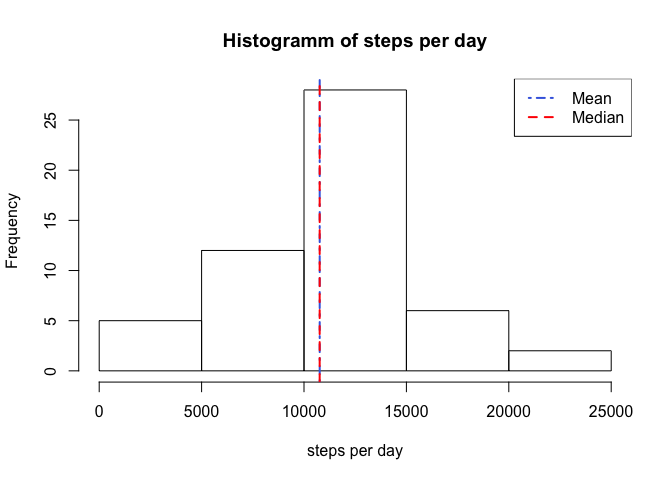
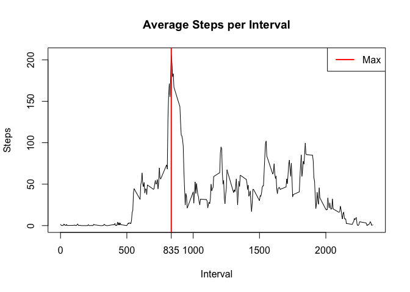
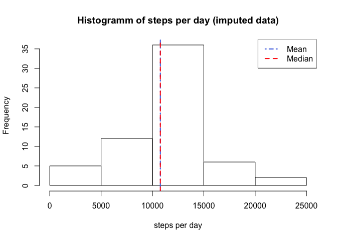
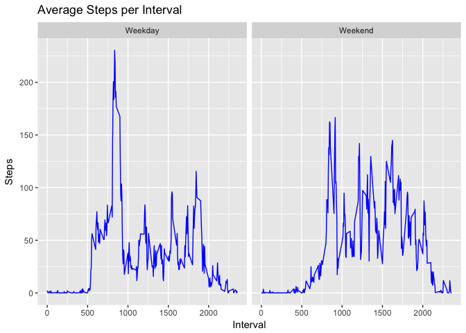

##Loading and preprocessing the data
We unzip and load the raw data first

```r
unzip("activity.zip")
raw_data <- read.csv("activity.csv", header=T)
```

we look at the raw data

```r
summary(raw_data)
```

```
##      steps                date          interval     
##  Min.   :  0.00   2012-10-01:  288   Min.   :   0.0  
##  1st Qu.:  0.00   2012-10-02:  288   1st Qu.: 588.8  
##  Median :  0.00   2012-10-03:  288   Median :1177.5  
##  Mean   : 37.38   2012-10-04:  288   Mean   :1177.5  
##  3rd Qu.: 12.00   2012-10-05:  288   3rd Qu.:1766.2  
##  Max.   :806.00   2012-10-06:  288   Max.   :2355.0  
##  NA's   :2304     (Other)   :15840
```

```r
str(raw_data)
```

```
## 'data.frame':	17568 obs. of  3 variables:
##  $ steps   : int  NA NA NA NA NA NA NA NA NA NA ...
##  $ date    : Factor w/ 61 levels "2012-10-01","2012-10-02",..: 1 1 1 1 1 1 1 1 1 1 ...
##  $ interval: int  0 5 10 15 20 25 30 35 40 45 ...
```

we create a copy of the raw data and convert the data variable into a data type 

```r
data <- raw_data
data$date <- as.Date(raw_data$date, format="%Y-%m-%d")
```

we look at the data again

```r
summary(data)
```

```
##      steps             date               interval     
##  Min.   :  0.00   Min.   :2012-10-01   Min.   :   0.0  
##  1st Qu.:  0.00   1st Qu.:2012-10-16   1st Qu.: 588.8  
##  Median :  0.00   Median :2012-10-31   Median :1177.5  
##  Mean   : 37.38   Mean   :2012-10-31   Mean   :1177.5  
##  3rd Qu.: 12.00   3rd Qu.:2012-11-15   3rd Qu.:1766.2  
##  Max.   :806.00   Max.   :2012-11-30   Max.   :2355.0  
##  NA's   :2304
```

```r
str(data)
```

```
## 'data.frame':	17568 obs. of  3 variables:
##  $ steps   : int  NA NA NA NA NA NA NA NA NA NA ...
##  $ date    : Date, format: "2012-10-01" "2012-10-01" ...
##  $ interval: int  0 5 10 15 20 25 30 35 40 45 ...
```

##What is mean total number of steps taken per day?
total number of steps taken per day

```r
steps_per_day <- aggregate(steps~date, data, sum)
```

mean and median

```r
mean_steps_per_day <- mean(steps_per_day$steps)
median_steps_per_day <- median(steps_per_day$steps)
```

plot histogram and add mean and median as vertical lines

```r
hist(steps_per_day$steps, main="Histogramm of steps per day", xlab="steps per day")
abline(v=mean(steps_per_day$steps), col="royalblue", lwd=2,lty=4)
abline(v=median(steps_per_day$steps), col="red", lwd=2, lty=2)
legend(x = "topright", c("Mean", "Median"),
 col = c("royalblue", "red"),
 lwd = c(2, 2),
 lty= c(4,2))
```

<!-- -->

##What is the average daily activity pattern?

```r
avg_steps_per_interval <- aggregate(steps~interval,data, mean)
plot(avg_steps_per_interval$interval, avg_steps_per_interval$steps, type="l", xlab="Interval", main="Average Steps per Interval", ylab="Steps")
maxx <- avg_steps_per_interval[which.max(avg_steps_per_interval$steps),1]
axis(1, at=maxx)
abline(v=maxx, col="red", lwd=2)
legend(x = "topright", c("Max"),
 col = c("red"),
 lwd = c(2))
```

<!-- -->


##Imputing missing values
number of rows with missing data

```r
sum(is.na(data))
```

```
## [1] 2304
```

looking at missing values

```r
xg <- split(data$steps, data$date)
daysna <- sapply(xg, function(x) mean(is.na(x)))
sum(daysna)
```

```
## [1] 8
```

```r
length(xg)
```

```
## [1] 61
```

There are 8 out of 53 days without any recorded steps in the intervals, this means all the intervals are empty. We will impute the missing intervals the mean for the specific interval.

```r
imputted_data <- data
sum(is.na(imputted_data$steps))
```

```
## [1] 2304
```

```r
naindex <- which(is.na(data$steps))
#imputted_data$steps[naindex] <- steps_per_interval$steps[steps_per_interval$interval == imputted_data$interval[naindex]]

for(i in naindex) 
{
  imputted_data$steps[i] <- avg_steps_per_interval$steps[avg_steps_per_interval$interval == imputted_data$interval[i]]
  
}

sum(is.na(imputted_data$steps))
```

```
## [1] 0
```
We will now look at the histogramm of the imputed data


```r
steps_per_day_imp <- aggregate(steps~date, imputted_data, sum)
hist(steps_per_day_imp$steps, main="Histogramm of steps per day (imputed data)", xlab="steps per day")
abline(v=mean(steps_per_day_imp$steps), col="royalblue", lwd=2,lty=4)
abline(v=median(steps_per_day_imp$steps), col="red", lwd=2, lty=2)
legend(x = "topright", c("Mean", "Median"),
 col = c("royalblue", "red"),
 lwd = c(2, 2),
 lty= c(4,2))
```

<!-- -->
As one can see above the median and mean values of the total steps per day do not changed when missing intervals are replaced with the mean of the interval. The histogram has changed on the middle bar which has increased and now contains the imputed values.

#Are there differences in activity patterns between weekdays and weekends?

```r
library(ggplot2)
imputted_data$fw <- as.factor(weekdays(imputted_data$date))
levels(imputted_data$fw)
```

```
## [1] "Friday"    "Monday"    "Saturday"  "Sunday"    "Thursday"  "Tuesday"  
## [7] "Wednesday"
```

```r
levels(imputted_data$fw) <- c("Weekday","Weekday","Weekend","Weekend","Weekday","Weekday","Weekday")
levels(imputted_data$fw)
```

```
## [1] "Weekday" "Weekend"
```


```r
steps_per_interval_fw <- aggregate(steps~interval+fw, imputted_data, mean)
g <- ggplot(steps_per_interval_fw,aes(interval, steps))
g+geom_line(col="blue")+
facet_wrap(~fw) + labs(x="Interval") + labs(y="Steps") + labs(title="Average Steps per Interval")
```

<!-- -->

